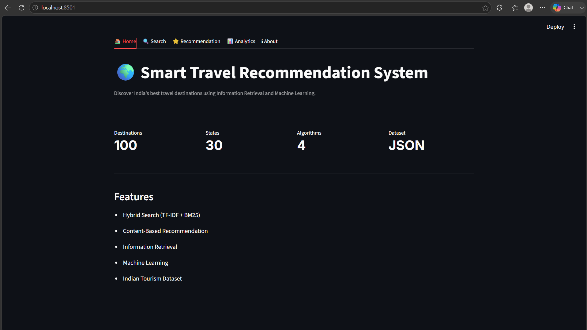
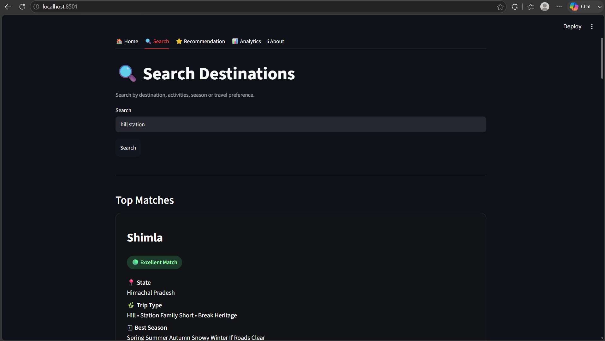
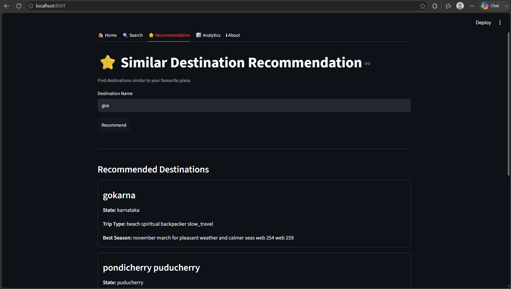
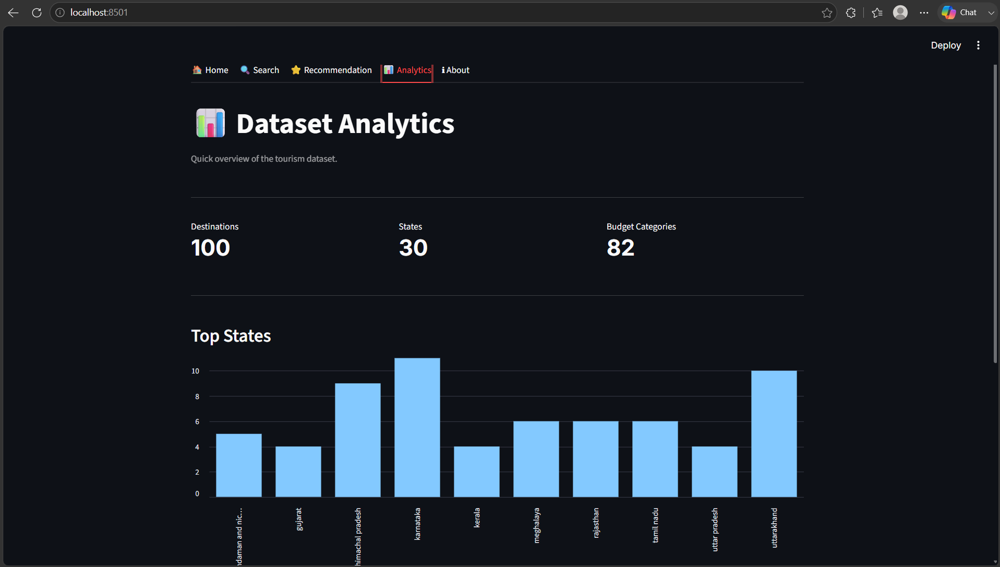

# 🌍 Smart Travel Recommendation System

A hybrid **Information Retrieval (IR)** and **Machine Learning (ML)** based travel recommendation system developed using Python and Streamlit.

The system helps users discover travel destinations across India by combining:

- 🔍 TF-IDF Search
- 📚 BM25 Ranking
- ⚡ Hybrid Retrieval
- ⭐ Content-Based Recommendation
- 📊 Interactive Analytics Dashboard

---

## 📸 Application Preview

### 🏠 Home



### 🔍 Search



### ⭐ Recommendation



### 📊 Analytics



---

# ✨ Features

- 🔍 Hybrid search using **TF-IDF** and **BM25**
- ⭐ Content-based travel destination recommendation
- 📊 Interactive analytics dashboard
- 🌏 Search destinations by activities, season, or travel preference
- ⚡ Fast retrieval using Information Retrieval techniques
- 🎨 Minimal and responsive Streamlit interface

---

# 🧠 Algorithms Used

## Information Retrieval

- TF-IDF Vectorization
- BM25 Ranking
- Hybrid Score Combination

## Machine Learning

- Content-Based Recommendation
- Cosine Similarity

---

# 🛠 Tech Stack

| Category | Technology |
|----------|------------|
| Language | Python |
| Framework | Streamlit |
| Data Processing | Pandas |
| Machine Learning | Scikit-learn |
| Information Retrieval | Rank-BM25 |
| Visualization | Streamlit Charts |
| Dataset | Indian Tourism Dataset (JSON) |

---

# 📂 Project Structure

```text
travel-recommender/
│
├── assets/
├── data/
│   ├── raw/
│   └── processed/
│
├── models/
├── notebooks/
│
├── src/
│   ├── preprocess.py
│   ├── ir_engine.py
│   ├── tfidf_engine.py
│   ├── bm25_engine.py
│   ├── ranking.py
│   ├── ml_engine.py
│   ├── recommender.py
│   ├── evaluation.py
│   └── utils.py
│
├── streamlit_app.py
├── requirements.txt
└── README.md
```